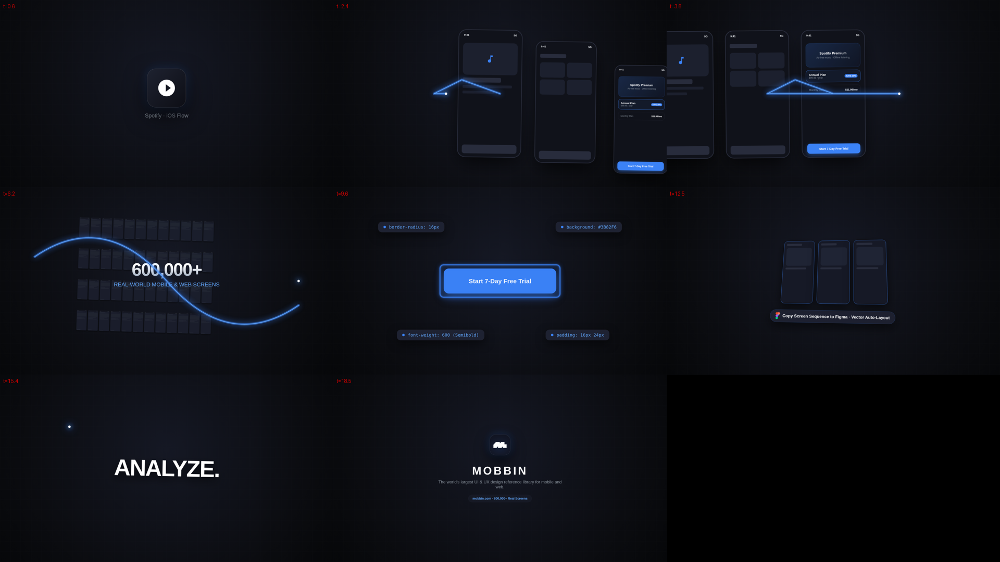
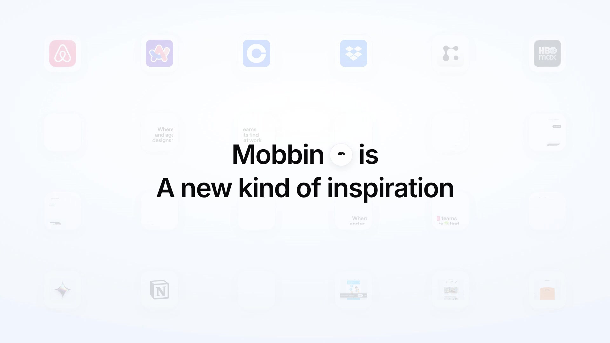

# Mobbin Motion Graphics Videos

High-end product launch and motion graphics showcase videos created for [Mobbin](https://mobbin.com/).

---

## 🌟 Cut 1: 20s Continuous One Take (`onetake-20s/`)

> Built with the [`onetake`](https://github.com/feitangyuan/onetake) motion framework. Every beat grows out of the previous one with zero slide transitions — guided by an unbroken glowing cobalt filament, shutter-blurred camera tracking, and sound scored to frame events.

- **Watch Video**: [**`onetake-20s/mobbin-20s.mp4`**](onetake-20s/mobbin-20s.mp4) (1080p @ 30fps, 4.1 MB)
- **Contact Sheet**: [**`onetake-20s/mobbin-20s-stills.png`**](onetake-20s/mobbin-20s-stills.png)
- **Full Breakdown & Source Code**: See [**`onetake-20s/README.md`**](onetake-20s/README.md)
- **Oracle Continuity Score**: `1.00` (Passed acceptance oracle)

---

## 🎬 Cut 2: 24s Launch Teaser (`Hyperframes`)

> A product teaser created using [Hyperframes](https://hyperframes.heygen.com/) and [/brag](https://github.com/latent-spaces/brag).

- **Watch Video**: [`brag.mp4`](brag.mp4) (1080p @ 30fps, 3.3 MB)
- **Preview Poster**:

### Storyboard Breakdown (24s)
1. **Scene 1 (0–4.2s): The Hook** — *"Where teams and agents find designs that work"* with 3D isometric phone mockups.
2. **Scene 2 (4.2–9.0s): The Scale** — *"400,000+ Searchable Screens"* across iOS, Android, and Web patterns.
3. **Scene 3 (9.0–14.5s): Deep User Flows** — End-to-end flow teardowns for Onboarding, Paywalls, and Checkout.
4. **Scene 4 (14.5–20.0s): AI & MCP** — *"Give your AI agents access to Mobbin"* featuring Model Context Protocol integration.
5. **Scene 5 (20.0–24.0s): Outro** — Mobbin wordmark and call-to-action.

---

## 📦 Repository Structure

- [`onetake-20s/`](onetake-20s/) — **20s One Take motion film**
  - [`mobbin-20s.mp4`](onetake-20s/mobbin-20s.mp4) — Rendered master video file
  - [`mobbin-20s-stills.png`](onetake-20s/mobbin-20s-stills.png) — Contact sheet stills
  - [`comp.html`](onetake-20s/comp.html) — Deterministic composition source
  - [`score.py`](onetake-20s/score.py) & [`sfx.wav`](onetake-20s/sfx.wav) — 32-event audio score
  - [`README.md`](onetake-20s/README.md) — Beat sheet & continuity report
- [`brag.mp4`](brag.mp4) — 24s Hyperframes teaser
- [`composition/`](composition/) — Hyperframes GSAP timeline composition
- [`brag-plan.md`](brag-plan.md) — Creative storyboard and pacing spec
- [`share-copy.txt`](share-copy.txt) — Ready-to-post social media caption
